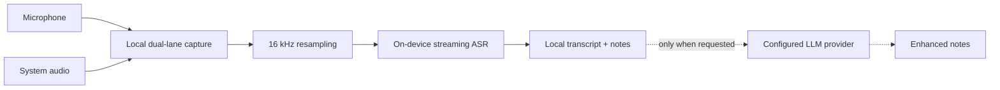
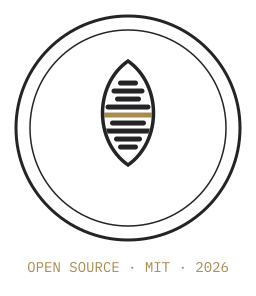

<p align="center">
  <picture>
    <source media="(prefers-color-scheme: dark)" srcset="./kiminola/branding/svg/kimi-nola-logo-primary-dark.svg">
    <source media="(prefers-color-scheme: light)" srcset="./kiminola/branding/svg/kimi-nola-logo-primary-light.svg">
    
  </picture>
</p>

<p align="center">
  <strong>Private, local meeting transcription with notes you control.</strong><br>
  Windows-first. On-device speech recognition. Optional AI enhancement. Open source.
</p>

<p align="center">
  <a href="#privacy-boundary">Privacy</a> ·
  <a href="#features">Features</a> ·
  <a href="#build-from-source">Build from source</a> ·
  <a href="./SPEC.md">Product spec</a> ·
  <a href="./LICENSE">MIT license</a>
</p>

> [!IMPORTANT]
> Kimi Nola is in active development. The application works from source, but signed installers, automatic updates, and the first public release are not published yet.

## What is Kimi Nola?

Kimi Nola is an open-source, Windows-first alternative to cloud meeting-note tools. It records microphone and system audio as separate lanes, transcribes both locally, and gives you a notes-first workspace during and after the meeting.

When you want a polished summary, Kimi Nola can send transcript **text** and your notes to an OpenAI-compatible provider that you configure. The recording itself never leaves your computer.

| Local by default | Notes first | Bring your own AI |
|---|---|---|
| Streaming speech recognition runs on-device. Audio is not uploaded or retained. | Write freely while a live transcript stays close by, then edit or export the result. | Use OpenRouter, OpenAI, Ollama, LM Studio, or another compatible endpoint. Enhancement is optional. |

## Features

- Local streaming transcription using sherpa-onnx and Nemotron Speech
- Separate microphone and Windows system-audio capture, labeled **You** and **Others**
- Notes-first recording view with a collapsible live transcript
- Pause, resume, stop, and configurable global-shortcut controls
- Meeting library with SQLite persistence and full-text search
- Editable transcript segments and Markdown notes
- Optional AI-enhanced notes with built-in or custom templates
- OpenAI-compatible provider configuration with credentials stored in Windows Credential Manager
- Markdown notes and plain-text transcript export
- First-run microphone check and resumable, SHA-256-verified model download
- Native Windows x64 and ARM64 architecture
- No usage analytics; crash reporting, when added, will remain opt-in

## Privacy boundary

Kimi Nola is designed around a simple line: **audio never leaves the machine**.

| Data | Default behavior |
|---|---|
| Microphone and system audio | Processed in memory for local transcription; not uploaded or retained |
| Transcript, notes, and meeting metadata | Stored locally in SQLite under `%LOCALAPPDATA%\Kiminola\data` |
| Speech-recognition model | Downloaded to `%LOCALAPPDATA%\Kiminola\models` and verified locally |
| AI note enhancement | Sends transcript text and notes only after you explicitly request enhancement |
| API credentials | Stored in Windows Credential Manager through `keyring` |
| Usage analytics | Never collected |

## How it works



The desktop shell is Tauri 2. The Svelte frontend handles the library, recording workspace, onboarding, meeting detail, and settings. Rust owns audio capture, transcription, persistence, exports, model management, shortcuts, and the optional LLM-provider bridge.

## Technology

| Area | Implementation |
|---|---|
| Desktop | Tauri 2, Rust |
| Interface | SvelteKit, TypeScript, Tailwind CSS v4, shadcn-svelte |
| Audio | windows-rs WASAPI loopback, cpal microphone capture, rubato resampling |
| Transcription | sherpa-onnx C API, Nemotron Speech 0.6B INT8 |
| Storage | SQLite, sqlx, FTS5 |
| AI enhancement | Streaming OpenAI-compatible `ChatProvider` seam |
| Secrets | Windows Credential Manager via `keyring` |

## Install

There is no public installer yet. The first Windows x64 and ARM64 installers will be published on [GitHub Releases](https://github.com/Trillx/Kiminola/releases). Until then, use the source setup below.

When a release is available, choose:

- **x64** for Intel and AMD Windows PCs
- **ARM64** for Snapdragon and other Windows-on-ARM PCs

The first launch downloads the pinned Nemotron speech model (about 632 MB) and stores it locally. An internet connection is required for that initial download; optional AI note enhancement also contacts only the provider you configure.

## Build from source

### Prerequisites

- Windows 10 or 11 on x64 or ARM64
- Node.js and npm
- Rust stable with the MSVC toolchain
- Visual Studio Build Tools with **Desktop development with C++**
- LLVM installed at `C:\Program Files\LLVM`
- sherpa-onnx 1.13.5 shared Windows libraries for your target architecture, available from the [upstream release assets](https://github.com/k2-fsa/sherpa-onnx/releases)

The native sherpa-onnx package is not committed to this repository. Download and extract the matching x64 or ARM64 shared package under `kiminola/src-tauri/`, then set `SHERPA_ONNX_LIB_DIR` to its `lib` directory in the PowerShell session that runs Cargo or Tauri.

```powershell
git clone https://github.com/Trillx/Kiminola.git
cd Kiminola\kiminola
npm install

# Replace the example folder name with the package you downloaded.
$sherpaRoot = Resolve-Path ".\src-tauri\sherpa-onnx-v1.13.5-win-arm64-shared-MD-Release"
$env:SHERPA_ONNX_LIB_DIR = Join-Path $sherpaRoot.Path "lib"

npm run tauri dev
```

On ARM64, ensure `C:\Program Files\LLVM\bin` is on `PATH` before running Cargo. The repository Cargo config supplies the clang and libclang paths used by the ARM64 toolchain.

Frontend-only development does not require the native Rust dependencies:

```powershell
cd kiminola
npm install
npm run dev
```

### Validation

```powershell
cd kiminola
npm run check
npm run build

cd src-tauri
cargo check
cargo test
```

For a packaged Windows build, run `npm run tauri build` from `kiminola/` after the validation commands.

The commands above verify the frontend, Rust code, and build pipeline. They do not prove that live microphone capture, system-audio loopback, model loading, or transcription work on a particular machine. Changes to those areas should also be checked by launching `npm run tauri dev`, completing onboarding, recording a short test meeting, and confirming that the **You** and **Others** transcript lanes update.

## Project structure

```text
Kiminola/
├── SPEC.md                 Product decisions and MVP boundary
├── CONTEXT.md              Domain language and terminology
├── kiminola/               Tauri + SvelteKit application
│   ├── branding/           Approved Oatwave identity and SVG sources
│   ├── src/                Svelte frontend
│   └── src-tauri/          Rust backend, migrations, and model manifest
└── .scratch/kiminola/      Historical research, prototypes, and decisions
```

[`SPEC.md`](./SPEC.md) is the source of truth for product behavior and scope. [`kiminola/branding/HANDOFF.md`](./kiminola/branding/HANDOFF.md) defines the Oatwave visual system used by the app and this repository.

## Road to the first release

- Finalize and verify every Model pack manifest hash
- Make native sherpa-onnx setup portable across clean x64 and ARM64 checkouts
- Add Windows x64 and ARM64 release CI
- Produce signed NSIS installers and portable archives
- Enable signed Tauri updater manifests through GitHub Releases

Work outside the MVP—calendar integration, automatic meeting detection, audio retention, semantic search, speaker diarization, and fully local LLM enhancement—remains intentionally deferred.

## Contributing

Issues and focused pull requests are welcome. See [`CONTRIBUTING.md`](./CONTRIBUTING.md) for the development setup, validation checklist, bug-report details, and pull-request expectations. Before proposing a feature, check the MVP boundary in [`SPEC.md`](./SPEC.md). Please keep the privacy promise intact and avoid adding analytics.

The visual identity is intentionally constrained. New product surfaces should follow [`kiminola/branding/HANDOFF.md`](./kiminola/branding/HANDOFF.md): no gradients, no off-palette colors, and one gold emphasis per view.

## License

Kimi Nola is available under the [MIT License](./LICENSE).

<p align="center">
  <picture>
    <source media="(prefers-color-scheme: dark)" srcset="./kiminola/branding/svg/kimi-nola-stamp-dark.svg">
    <source media="(prefers-color-scheme: light)" srcset="./kiminola/branding/svg/kimi-nola-stamp-light.svg">
    
  </picture>
</p>
